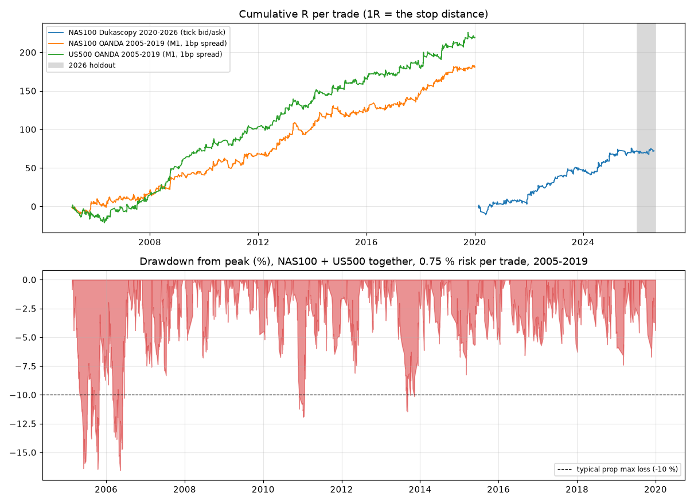

# EvalPass: NY-session index momentum EA for MetaTrader 5 (prop-challenge edition)

`mt5/Experts/EvalPassMomentum.mq5` is an Expert Advisor for **NAS100 / US100** and **US500**. It trades the
New York cash session (09:30-16:00 New York time), takes 0-3 trades per day per symbol, and puts a
hard stop-loss on every order. It closes everything by 15:55 New York time, so nothing is held
overnight or over the weekend. A prop-firm guard (daily stop, max-loss stop, profit-target lock) sits
on top.

Everything below comes from backtests on real data, run with a 10-second bid/ask simulator. The
research code is in `research/`.

## TL;DR

| | |
|---|---|
| Edge | Intraday momentum out of the "noise area" around the 09:30 open (Zarattini, Aziz & Barbon, 2024) |
| Markets | NAS100 (US100) and US500 (S&P 500 CFD). Run one chart per symbol. |
| Trades | about 60-90 per year per symbol, held for 30 minutes to about 6 hours |
| Stop / target | stop = 1 noise width, target = 2.5R, break-even (+0.1R) once +1.5R is reached |
| Robustness | 384 of 384 parameter combinations were profitable on all three independent datasets |
| Prop simulation (NAS100 + US500, 0.75 % risk per trade, 2005-2019) | +10 % target: 88 % pass, 6 % fail, median 113 days. +8 %: 90 % pass, median 80 days. Phase 2 (+5 %): 93 % pass, median 46 days |
| Honest caveats | 2026 (Jan-Aug, never used to choose anything) was **flat** (0.0R over 39 trades). The edge is sensitive to execution cost (see below). |
| Want it in about a week? | Optional **Sprint mode** (off by default): about 1 in 4 attempts pass within 7 days, median 15-20 days to funded if restarts are free, and about 1 in 3 attempts is halted at -8 %. See [Sprint mode](#sprint-mode-trying-to-pass-in-about-a-week-opt-in). |



## Why this and not tick scalping or HFT

I tested scalping first because that is what you asked for. The numbers ruled it out:

* **Data:** about 2.2 billion real Dukascopy bid/ask ticks from 2020 to 2026 for XAUUSD, NAS100,
  EURUSD, GBPUSD and USDJPY. I also used OANDA 1-minute bars for NAS100 and US500 from 2005 to 2020.
* **Simulator:** the backtester fills buys at the Ask and sells at the Bid, and triggers stop orders
  the way MT5 does. Stops and targets are checked on 10-second bars. If a stop-loss and a take-profit
  are both hit inside the same bar, the stop-loss is assumed to come first.
* **Gold scalping (M1-M15, mean reversion and breakouts, every session):** every variant lost money
  after the spread. The gold spread is 30-70 % of a typical 1-minute range, so each trade starts
  about 0.1R behind.
* **FX scalping (EURUSD, GBPUSD, USDJPY):** the edges were thin and inconsistent. USDJPY breakouts
  only made money during the 2021-22 uptrend. USDJPY mean reversion failed out of sample. EURUSD
  Asian-session mean reversion stayed mildly positive, but too weakly to rely on.
* **NY opening-range breakout on NAS100:** it looks good for 2020-2025 but is a coin flip on NAS100
  for 2005-2019 and negative on US500. I rejected it as a recent-period artefact.
* **NAS100 short-term mean reversion (any session window):** negative in every window, both in and
  out of sample.
* **Noise-area momentum on indices:** this is the one that survived everything:
  * in-sample 2020-23 and out-of-sample 2024-25;
  * 15 extra years of NAS100 and US500 data (2005-2019);
  * a 384-combination parameter grid (every combination profitable on every dataset);
  * cost stress tests;
  * an untouched 2026 holdout;
  * an independent bar-by-bar replica of the EA logic. This replica found a bug in my first
    backtest, which I fixed before the final selection.

True HFT and tick scalping are also banned or restricted at most prop firms. This EA holds trades
for minutes to hours, which is ordinary intraday trading.

## Strategy rules (what the EA does)

1. **Session open.** The session open is the close of the 09:30 New York 1-minute bar. `prevClose`
   is the previous session's 15:59 close.
2. **Noise width.** For every minute *t* after the open, the noise width is
   `sigma(t) = average over the last 30 sessions of |close(t) / open - 1|`.
3. **Bands.**
   * `upper = max(open, prevClose) * (1 + 2.0 * sigma(t))`
   * `lower = min(open, prevClose) * (1 - 2.0 * sigma(t))`
4. **Checks.** Every 30 minutes (10:00, 10:30, ... up to 15:30), the EA looks at the 1-minute bar
   that just closed:
   * if it closed above `upper`, it **buys**;
   * if it closed below `lower`, it **sells**.

   At most 3 entries per day and one position at a time per symbol.
5. **Risk on each trade.**
   * Stop-loss = `1.0 * sigma(t) * open`. This is a server-side stop that is always set.
   * Take-profit = 2.5 x the stop distance.
   * Once the trade is +1.5R in profit, the stop moves to entry + 0.1R.
6. **Session end.** Everything is closed at 15:55 New York time.
7. **Position size.** Lots are calculated so that hitting the stop loses `InpRiskPercent` of the
   balance. The calculation uses `OrderCalcProfit`, so it works for any contract size.

## Results

Full tables are in [`research/results/results.md`](research/results/results.md). They are
regenerated by `python research/report.py`.

Per trade, in R (1R = the stop distance). Costs include the real Dukascopy spread (1.4-3.4 index
points) or a 1 basis-point spread on the OANDA data.

| dataset | trades | win % | avg R | profit factor | Sharpe (daily) | profitable years |
|---|---|---|---|---|---|---|
| NAS100 Dukascopy 2020-2025 | 463 | 47.9 | +0.16 | 1.35 | 2.33 | 6 / 6 |
| NAS100 Dukascopy 2026 Jan-Aug (holdout) | 39 | 48.7 | 0.00 | 1.00 | 0.0 | flat |
| NAS100 OANDA 2005-2019 | 1338 | 47.4 | +0.14 | 1.30 | 1.98 | 15 / 15 |
| US500 OANDA 2005-2019 | 1427 | 48.7 | +0.15 | 1.34 | 2.26 | 14 / 15 (2005: -12.5R) |

Prop-challenge simulation. Every calendar day is used as a start date. Rules: 5 % daily loss
(including floating P/L), 10 % max loss, minimum 4 trading days, EA daily stop at 3 %. "Open" means
neither passed nor failed within 365 days.

| setup | target | pass | fail | open | median days to pass |
|---|---|---|---|---|---|
| NAS100 + US500, 0.50 % risk each | 10 % | 80 % | 1 % | 19 % | 165 |
| **NAS100 + US500, 0.75 % risk each (default)** | **10 %** | **88 %** | **6 %** | **6 %** | **113** |
| NAS100 + US500, 0.75 % risk each | 8 % | 90 % | 6 % | 4 % | 80 |
| NAS100 + US500, 0.75 % risk each | 5 % (phase 2) | 93 % | 6 % | 2 % | 46 |
| NAS100 + US500, 1.00 % risk each | 10 % | 84 % | 14 % | 2 % | 68 |
| NAS100 only (Dukascopy 2020-26), 1.00 % risk | 10 % | 64 % | 1 % | 35 % | 141 |

**How to read this:** raising the risk makes a pass faster but raises the failure rate quickly.
0.75 % per trade on both indices was the best balance. None of these numbers promise future
results, and 2026 so far has been a flat regime for this strategy.

**Execution cost matters.** On NAS100 (2020-2026), an extra ~1 index point of slippage per fill
lowers the Sharpe from 2.2 to 1.9, and ~2 points lowers it to 1.2. Use an account with tight index spreads.
`InpMaxSpreadPoints` can also block entries while the spread is wide.

## Install

1. Copy `mt5/Experts/EvalPassMomentum.mq5` to `<MT5 data folder>/MQL5/Experts/` (in MT5: File, then
   Open Data Folder).
2. Open it in MetaEditor and press **F7** to compile. It only uses the standard `Trade/Trade.mqh`.
3. Attach it to a **US100 / NAS100** chart. Any timeframe works; the EA reads M1 data itself. For
   diversification, attach a second copy to a **US500** chart with the **same magic number**, so
   both charts share one account-level guard. Enable Algo Trading.
4. Optional: load a preset from `mt5/Presets/` (EA properties, Inputs tab, **Load**).
   `EvalPass_Standard.set` holds the defaults above; the sprint presets are described
   [below](#sprint-mode-trying-to-pass-in-about-a-week-opt-in).
5. Check the Experts log and the chart panel. The panel shows *New York time*. If that time is
   wrong, fix the broker-clock inputs (next section).

### Broker clock (important)

The session logic runs on New York time. The EA converts server time to New York time with these
inputs:

* `InpServerGMTWinter`: the server's GMT offset in winter (default **2**).
* `InpServerDST`: the server's daylight-saving rule (default **US**). This matches the usual
  "GMT+2 winter / GMT+3 summer, New York close" servers that most prop firms and brokers use.

On a live or demo chart, `InpAutoGMTOffset` compares the server clock with `TimeGMT()` and corrects
the offset automatically. **The Strategy Tester has no real GMT**, so for backtests these two inputs
must be correct for your broker. The quick check: the bar where US index volume explodes each day
must show on the panel as 09:30 New York time.

### Strategy Tester

* Model: **Every tick based on real ticks**. Timeframe: M1. Deposit: your challenge size.
* Start the test at least 2 months after the first available M1 data. The EA needs 30 past sessions
  and waits until they exist.
* Compare the per-trade R distribution with `research/results/results.md`, not just the net profit.

## Settings

| input | default | meaning |
|---|---|---|
| `InpLookbackDays` | 30 | sessions averaged for the noise width |
| `InpBandMult` | 2.0 | band = 2.0 x noise width (1.5 gives more trades, less consistency) |
| `InpCheckEveryMin` | 30 | signal check interval |
| `InpExitMode` | none | extra signal exits (none / back inside band / opposite band) |
| `InpStopMode`, `InpStopSigma` | sigma, 1.0 | stop = 1 noise width |
| `InpTakeProfitR` | 2.5 | target in R |
| `InpBETriggerR`, `InpBEOffsetR` | 1.5, 0.1 | break-even rule |
| `InpMaxTradesPerDay` | 3 | per symbol, per New York day |
| `InpRiskPercent` | 0.75 | % of balance lost if the stop is hit |
| `InpMaxSpreadPoints` | 0 (off) | skip entries when the spread (in points) is above this |
| `InpChallengeBalance` | 0 | initial challenge balance (0 = balance when first started) |
| `InpDailyStopPct` | 3.0 | stop trading for the day (and close trades) at -3 % of initial balance vs. the day's start |
| `InpMaxLossStopPct` | 8.0 | halt the EA at -8 % of initial balance (a buffer before the usual -10 %) |
| `InpTargetPct` | 10.0 | close everything and halt once equity is +10 % (set 5 for phase 2, **0 on a funded account**) |
| `InpResetGuard` | false | set true once when you start a new challenge on the same terminal |
| `InpMagic` | 26092501 | use the same value on the NAS100 and US500 charts |

Risk presets (per trade, per symbol, both charts running):

* **Conservative:** 0.50 %. Fewest failures, about 5-6 months median to +10 %.
* **Standard:** 0.75 %. The default.
* **Fast:** 1.00 %. About 2-3 months median, but roughly 1 in 7 attempts fails.

## Sprint mode: trying to pass in about a week (opt-in)

The standard settings target steady progress, and that takes months: about 3.5 trades a week, each
risking 0.75 %. There is no way to reach +10 % in a week from that edge without risking much more
per trade. Sprint mode does exactly that, as safely as it can be done. It is **off by default**:
the standard mode above is unchanged.

**What Sprint mode changes (entries, stops and targets stay exactly the same):**

* **Target-based sizing.** Each trade risks `(target - current profit) / 2.5`, capped at 4 % of the
  initial balance. So one winner at the 2.5R take-profit reaches the target: on a fresh +10 %
  challenge that is 4 % risk, and it shrinks as you get closer.
* **Account-wide risk budget (all charts with the same magic number).** A new trade only gets the
  room left before a worst-case -4 % day or -9.5 % total. That room counts what every open position
  could still lose down to its stop. Normal stop-outs therefore cannot breach the firm's 5 % daily or
  10 % total limits; only a price gap through a stop can. When several charts signal at the same
  check, they take turns through a shared lock, so they cannot all size against the same room.
* **Stop and restart at -8 %.** The EA halts at -8 % (`InpMaxLossStopPct`). An account that deep
  would need weeks at tiny size to recover, so a new challenge is the faster route if retries are
  free or cheap.
* **More markets = more chances per week.** The same strategy with the same settings (not
  re-tuned) also works on **US2000** (Russell 2000; 2005-2019: 12 of 15 years profitable) and on
  **JP225** during the Tokyo session (2010-2019: 8 of 10 years profitable, essentially uncorrelated
  with the US indices). Both are more sensitive to spread than NAS100/US500.
* **Minimum-trading-days helper.** Many firms require e.g. 4 trading days. After the target is hit,
  the EA places one minimum-lot trade per day (closed about a minute later) until the count is
  reached. With it, a 1-week pass stays possible, because 4 trading days always fit into 7 calendar
  days. It is off unless `InpMinTradingDays` > 0.

**Simulated results.** Every calendar day is used as a start date; full table in
[`research/results/sprint.md`](research/results/sprint.md).

| markets running Sprint mode | pass within 7 days | within 14 days | within 30 days | halted at -8 % within 30 days | median days to funded (free restarts) |
|---|---|---|---|---|---|
| NAS100 + US500 | 23 % | 31 % | 44 % | 33 % | 20 |
| NAS100 + US500 + US2000 | 25 % | 35 % | 49 % | 34 % | 17 |
| NAS100 + US500 + US2000 + JP225 | 27 % | 37 % | 51 % | 35 % | 15 |
| NAS100 only, recent data (2020-26) | 20 % | 27 % | 37 % | 29 % | 38 |
| *reference: Standard mode, NAS100 + US500* | *1 %* | *3 %* | *10 %* | *1 %* | *113 (single attempt)* |

**How to read this:**

* **Worth it only if a failed attempt is free or cheap.** About a quarter of attempts pass inside a
  week, but about a third are halted at -8 % and need a new challenge. On a single paid attempt,
  Standard mode (88 % pass) is the better bet.
* **Use the fast lane for the challenge only.** Once funded, go back to `EvalPass_Standard.set` (and
  `InpTargetPct = 0`). Sprint sizing is a way to pass a challenge, not a way to manage a funded
  account.
* **Check your firm's rules first.** Some firms limit risk per trade, or flag "all-in" sizing as
  gambling.

**Set-up for Sprint mode:**

1. Attach the EA to **US100/NAS100, US500 and US2000** charts with `EvalPass_Sprint_US.set`.
   Optionally add a **JP225** chart with `EvalPass_Sprint_JP225.set` (Tokyo session inputs).
   Use the **same magic number everywhere**: the risk budget and the halt are shared across charts.
2. The presets set `InpTargetPct = 10.2`, a small buffer above a 10 % target so the helper's
   micro trades cannot drop you below it. They also set `InpMinTradingDays = 4` and
   `InpDailyStopPct = 4.5`, a last-resort cap below the firm's 5 %. Adjust the target and minimum days
   to your firm (phase 2: `InpTargetPct = 5.2`).
3. Set `InpMaxSpreadPoints` for each symbol so no entry is taken when the spread is unusually wide.
   This matters most on US2000 and JP225.

| sprint input | preset | meaning |
|---|---|---|
| `InpSprintMode` | true | switch sizing from fixed % to target-based |
| `InpSprintMaxRiskPct` | 4.0 | max risk per trade, % of initial balance |
| `InpSprintMinRiskPct` | 0.25 | skip a trade if less than this fits in the budget |
| `InpSprintWinR` | 2.5 | size so that one win of this many R reaches the target |
| `InpSprintDailyBudget` | 4.0 | worst-case daily loss incl. open stops (all charts) |
| `InpSprintTotalBudget` | 9.5 | worst-case total loss incl. open stops (all charts) |
| `InpSessionTZ` | New York / Tokyo | session clock (Tokyo for JP225: 09:00-15:00, checks 09:30-14:30) |
| `InpMinTradingDays` | 4 | minimum-days helper after the target (0 = off) |
| `InpHelperHHMM` | 1005 / 935 | session time of the helper's micro trade |

## Prop-firm notes

* **Minimum trading days.** The EA halts as soon as the target is hit. If your firm needs a minimum
  number of trading days, you may need to place tiny trades yourself on the remaining days.
* **Your firm's actual rules.** Check whether the max loss is static or trailing, and when the daily
  reset happens (`InpDayResetHour`). The EA's own daily and max-loss stops are deliberately tighter
  than typical firm limits.
* **News.** No news filter is built in. If your firm bans trading around high-impact news, pause the
  EA on those days (FOMC days in particular).
* **Duplicate charts.** Never attach two copies to the same symbol with the same magic number.

## Reproduce the research

```bash
pip install -r research/requirements.txt
bash research/get_data.sh        # downloads and converts the data (NAS100 ticks + OANDA indices)
cd research
python report.py                 # results/results.md + results/equity.png
python robust_grid.py            # 384-config robustness grid on 3 datasets
python sprint_report.py          # results/sprint.md
```

| file | role |
|---|---|
| `research/bt.py` | bid/ask backtest engine (numba), 10-second execution |
| `research/strategies.py` | strategy generators (noise-area momentum, ORB, mean reversion, breakout) |
| `research/ea_replica.py` | independent bar-by-bar copy of the EA logic, used to cross-check the backtest |
| `research/prop.py` | prop-challenge and account-curve simulation |
| `research/sprint.py`, `research/sprint_report.py` | Sprint-mode simulation (risk budget, halt and restart) |
| `research/scan_mr.py`, `research/scan_bo.py` | scalping scans that did not survive |

## Risk warning

Backtests are not guarantees. The edge was flat in 2026 year-to-date, execution costs differ between
brokers, and any strategy can go through losing periods longer than the ones in its history. Run it
on a demo or in the Strategy Tester with your broker's data before paying for a challenge.
